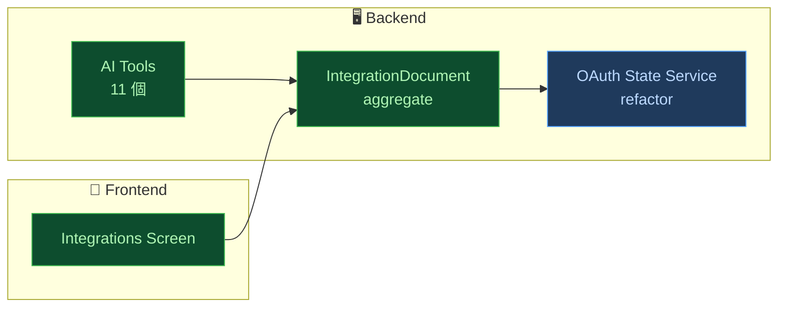
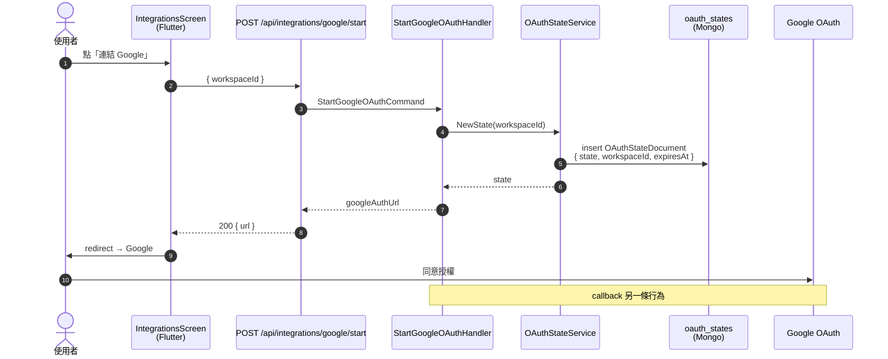

# PR Walkthrough 工作流程

把當前分支（vs main）的最終差異，重新組織成**邏輯功能元件**與**測試清單**，生成可點擊瀏覽的本機 web 頁面。**不再以 commit 為單位**——使用者看到的是 PR 完成後的「整體成果地圖」。

## 工作流程概覽

```
┌──────────────────────────────────────────────────────────────┐
│  Phase 1: 靜默分析整個 PR（不對使用者輸出大量內容）             │
│  ① git diff <base>..HEAD 拿整體 diff 與檔案清單                │
│  ② Explore subagent 把檔案歸類成邏輯功能元件 (8-12 個)         │
│  ③ Explore subagent 收集所有測試（unit / BDD / widget）         │
│  ④ Claude 主 context 拿到結構化 JSON（元件 / 測試 / 摘要）      │
└──────────────────────────────────────────────────────────────┘
                           ↓
┌──────────────────────────────────────────────────────────────┐
│  Phase 2: 生成 HTML + 啟動 server                              │
│  ① 寫 index.html（整體摘要 + Mermaid 元件圖 + 元件 grid + 測試）│
│  ② 寫 component-<slug>.html × N                                 │
│  ③ python3 -m http.server <random_free_port>（背景跑）         │
│  ④ open http://localhost:<port>                                │
│  ⑤ 一句話告訴使用者：「已分析、瀏覽器開好了、URL=…」            │
└──────────────────────────────────────────────────────────────┘
                           ↓
┌──────────────────────────────────────────────────────────────┐
│  Phase 3: 等使用者                                              │
│  不主動講話。使用者看完關掉瀏覽器後回來提問，正常回應。           │
└──────────────────────────────────────────────────────────────┘
```

---

## Phase 1 — 靜默分析整個 PR

**對使用者只說一句話**：「正在分析這個 PR，稍候…」

### 1.1 拿 PR 範圍

```bash
# 預設 base = main；user 可指定其他 base
git rev-list <base>..HEAD                          # 確認有 commit
git diff --stat <base>..HEAD                       # 拿改動檔案清單與 +/-
git diff <base>..HEAD                              # 拿完整 diff
```

**Edge cases**：
- 沒有 commit（HEAD == base）→ 告訴使用者「目前分支沒有領先 base 的 commit」，結束 skill。
- 找不到 main 分支 → 試 `master`、`develop`，再不行就問使用者要用哪個 base。
- 100+ commits / 10000+ 行 diff → 仍可跑，但提示使用者「PR 很大，分析會花 ~2-3 分鐘」。

### 1.2 派出兩個 Explore subagent（平行）

**重要：在單一訊息中派出，享受平行**。任務切兩塊以平衡 context 量：

#### Subagent A — 元件分類 + 摘要

```
你負責分析這個 PR 的整體變更，把改動的檔案歸類成「邏輯功能元件」。

Repository: /Users/paulwu/Documents/Github/elemi
Base: <base>  Head: HEAD
Branch: <branch-name>

跑這些指令理解 PR：
1. git diff --stat <base>..HEAD           # 所有改動檔案
2. git log --oneline <base>..HEAD         # commit history（推斷主軸）
3. git diff <base>..HEAD                  # 完整 diff（分塊讀避免超量）
4. 必要時讀 docs/superpowers/specs/、plans/ 找 design 文件

把 PR 切成 8-12 個「邏輯功能元件」。元件不是檔案 / 不是 class——是「有語意的功能單位」。例如：

- 「Google OAuth Flow」是一個元件，內含 login/callback/confirm 3 個 endpoint + OAuthClient + SessionStore + Command/Handler 等多個檔案
- 「Calendar AI Tools」是一個元件，內含 6 個 tool 檔案 + GoogleCalendarApiClient + DTOs
- 「OAuth State Service Refactor」是一個元件（重構類型）

對每個元件，產出以下 JSON：

{
  "id": "<kebab-case slug，會變 URL>",
  "name": "<中文 + 英文，例如：Google OAuth Flow / OAuth 授權流程>",
  "kind": "new|modified|refactored|removed",
  "stack": "backend|frontend|docs|ci|infra",
  "summary": "<2-3 段中文：為什麼存在 + 做了什麼 + 重要設計決策。對沒看過程式碼的人解釋>",
  "files": ["apps/backend/.../Foo.cs", "..."],
  "publicSurface": [
    { "kind": "type|method|endpoint|graphql|i18n|env|migration|other", "name": "...", "change": "added|removed|modified", "where": "file:line" }
  ],
  "keySnippets": [
    {
      "file": "apps/backend/.../Foo.cs",
      "language": "csharp",
      "caption": "<為什麼這段值得看，例如「核心 OAuth state token 結構」>",
      "code": "<20-50 行的程式碼，Claude 挑最能代表這個元件的片段，可以不完整>"
    },
    ...
  ],
  "dependsOn": ["<other component id>", ...]
}

接著盤點這條 PR **新增 / 改變了哪些「使用者行為」**（behavior flows）。一條行為 = 一個可被使用者觀察到的端到端流程，從前端某個操作觸發，最後資料落到 DB（或拿到回應渲染）。一個 PR 通常 2-6 條（小 PR 可能 1 條，大 PR 切 6-8 條，不要切超過 10 條）。

對每條行為產出：

{
  "id": "<kebab-case slug>",
  "name": "<中文行為名稱，例如「使用者綁定 Google 帳號」>",
  "trigger": "<什麼操作觸發，例如「在 Integrations 設定頁點『連結 Google』」；若是被動 / 排程觸發，描述觸發源>",
  "summary": "<1-2 句中文：這個行為的目的與最終結果>",
  "relatedComponentIds": ["<component id>", ...],
  "steps": [
    {
      "layer": "frontend|api|backend|db|external",
      "actor": "<元件名稱，例如 IntegrationsScreen / POST /api/integrations/google/start / StartGoogleOAuthHandler / oauth_states (Mongo) / Google OAuth Server>",
      "file": "<檔案路徑:行號，若有；external/db collection 可省略>",
      "action": "<這步做了什麼，中文 1 句>",
      "payload": "<這步傳出去 / 寫入的關鍵欄位，例如 'workspaceId, redirectUri' 或 'OAuthStateDocument { state, workspaceId, expiresAt }'；無資料傳遞可省略>",
      "returns": "<這步回傳什麼，例如 'googleAuthUrl'；無回傳可省略>"
    },
    ...
  ],
  "dbEffects": [
    {
      "collection": "<collection / table 名稱>",
      "operation": "insert|update|delete|read",
      "shape": "<寫入或讀出資料的關鍵欄位，例如 'IntegrationDocument { workspaceId, provider, accessToken (encrypted), refreshToken (encrypted), scopes[] }'>"
    }
  ]
}

**行為流程規則**：
- 一條行為的 `steps` 通常 4-10 步；過長代表拆得太粗，建議拆兩條
- `layer` 用來在 sequence 圖上歸到不同的 participant 群組
- `actor` 是 sequence 圖上的 participant 名稱，要簡短可讀（例如 `StartOAuthHandler` 而非 `Elemi.Backend.Integrations.OAuth.StartGoogleOAuthHandler`）
- 若該 PR 只是純重構 / docs / 測試（無使用者可見行為改變），`behaviorFlows` 可以是空 array `[]`，但元件仍要照常分類
- 第三方 API 呼叫（Google / LINE / Meta...）用 `layer: "external"`，actor 寫服務名

接著產出 PR 整體摘要：

{
  "overallSummary": "<1-2 段中文，講這條 PR 對使用者 / 系統帶來什麼改變>",
  "headline": "<一句話：這條 PR 主要做了什麼>",
  "stats": { "totalFiles": N, "totalAdditions": N, "totalDeletions": N, "totalCommits": N }
}

最終以單一 JSON 物件回傳：

{
  "components": [ ... 8-12 個 ... ],
  "behaviorFlows": [ ... 0-8 個 ... ],
  "overallSummary": "...",
  "headline": "...",
  "stats": { ... }
}

**規則**：
- `keySnippets` 每個元件 1-4 段，總共不要超過 200 行
- `summary` 中文描述「為什麼」要重於「做了什麼」
- `dependsOn` 只列重要相依，不要每個都列（避免 mermaid 太亂）
- `kind` 判斷：純新增 → new；既有檔案有大改 → modified；重構（行為不變）→ refactored
- 直接回 JSON 物件字串，不要 markdown code fence
```

#### Subagent B — 測試清單

```
你負責盤點這個 PR 新增 / 修改的所有測試。

Repository: /Users/paulwu/Documents/Github/elemi
Base: <base>  Head: HEAD

跑這些指令：
1. git diff --name-only <base>..HEAD | grep -E "(Tests/|\.feature|_test\.dart)"
2. git show <file> 拿每個測試檔的完整內容
3. 必要時讀現有測試了解 helper / setup

把所有測試分三類：
- **Backend Unit (xUnit)**：apps/backend/elemi-backend.Tests/ 下的 .cs
- **Backend BDD (Reqnroll)**：apps/backend/elemi-backend.BddTests/Features/ 下的 .feature
- **Frontend Widget (Flutter)**：apps/frontend/test/ 下的 _test.dart

對每個測試案例（.feature 的話是每個 Scenario；.cs 的話是每個 [Fact] / [Theory] 方法；.dart 的話是每個 testWidgets / test() 呼叫），產出：

{
  "id": "<kebab-case slug>",
  "category": "unit|bdd|widget",
  "name": "<原始測試 / scenario 名稱>",
  "componentId": "<這測試屬於哪個 component（盡量對應 Subagent A 的 component id；猜不到留 null）>",
  "file": "<檔案路徑>",
  "scenario": "<中文敘述：這個測試在驗證什麼。對 BDD 是改寫 Given/When/Then 成 1 段中文；對 unit/widget 是從 method name + body 推斷出測試意圖>",
  "givenWhenThen": {
    "given": "<前置條件中文>",
    "when": "<操作中文>",
    "then": "<預期結果中文>"
  },
  "code": "<完整測試碼，BDD 用該 Scenario 整段，unit/widget 用該 method 整個>"
}

**規則**：
- BDD 的 .feature 本身就是中文 Given/When/Then，直接抓
- Unit test method name 通常是 Pattern_Condition_Expected，從中拆解
- `componentId` 盡量推斷，例如 GoogleOAuthClientTests → google-oauth-flow
- 一個 test class 多個 [Fact] 就拆成多個項目，不要合併
- 直接回 JSON array of test objects，不要 markdown code fence
```

### 1.3 收集結果

主 context 合併兩個 subagent 的結果。**主 context 不複述 raw diff / raw test code**——這些字串只進 HTML，不留在對話脈絡。

---

## Phase 2 — 生成 HTML + 啟動 server

### 2.1 準備輸出目錄

```bash
mkdir -p .claude/pr-walkthroughs/<branch-name>/
```

`<branch-name>` 取自 `git branch --show-current`，把 `/` 換成 `-`。每次清空舊內容。

### 2.2 生成 `index.html`

結構：

```
┌────────────────────────────────────────────────────────┐
│ <分支名> vs <base>                  N commits · M files│
├────────────────────────────────────────────────────────┤
│ 🎯 一句話總結                                            │
│ <headline>                                              │
│                                                          │
│ 📋 整體摘要                                              │
│ <overallSummary，1-2 段>                                │
├────────────────────────────────────────────────────────┤
│ 🗺️ 元件地圖                                             │
│ ┌────────────────────────────────────────────────┐    │
│ │  [Mermaid flowchart]                            │    │
│ │    subgraph Backend                              │    │
│ │      [Component 1]:::new                         │    │
│ │      [Component 2]:::modified                    │    │
│ │    subgraph Frontend                             │    │
│ │      [Component 3]:::new                         │    │
│ │    Component 1 --> Component 2                   │    │
│ │  classDef new       fill:#0d4d2e,stroke:#3fb950 │    │
│ │  classDef modified  fill:#5c4519,stroke:#d29922 │    │
│ │  classDef refactored fill:#1f3a5c,stroke:#58a6ff│    │
│ │  classDef removed   fill:#5d0f12,stroke:#f85149 │    │
│ └────────────────────────────────────────────────┘    │
│ 圖例：🟢 新增  🟡 修改  🔵 重構  🔴 刪除                │
├────────────────────────────────────────────────────────┤
│ 🔄 行為流程（這條 PR 新增/改變了哪些使用者行為）         │
│ ┌────────────────────────────────────────────────┐    │
│ │ Tab 切換：[行為 1] [行為 2] [行為 3] ...          │    │
│ │                                                  │    │
│ │ ▸ 名稱：使用者綁定 Google 帳號                    │    │
│ │ ▸ 觸發：Integrations 設定頁點「連結 Google」      │    │
│ │ ▸ 摘要：取得 OAuth 授權，把 token 存進 DB          │    │
│ │                                                  │    │
│ │ [Mermaid sequenceDiagram]                        │    │
│ │   participant U as 使用者                         │    │
│ │   participant FE as IntegrationsScreen           │    │
│ │   participant API as POST /api/.../start         │    │
│ │   participant BE as StartGoogleOAuthHandler      │    │
│ │   participant DB as oauth_states                 │    │
│ │   U->>FE: 點「連結 Google」                       │    │
│ │   FE->>API: workspaceId                          │    │
│ │   API->>BE: command                              │    │
│ │   BE->>DB: insert OAuthStateDocument {...}       │    │
│ │   BE-->>FE: googleAuthUrl                        │    │
│ │   FE->>U: redirect Google                        │    │
│ │                                                  │    │
│ │ 💾 DB 影響：                                      │    │
│ │   • oauth_states (insert) — { state, ws, exp }   │    │
│ │   • integrations (insert/update) — { tokens }    │    │
│ │                                                  │    │
│ │ 🔗 相關元件：Google OAuth Flow, IntegrationDoc   │    │
│ │   （點擊跳對應 component-<slug>.html）             │    │
│ └────────────────────────────────────────────────┘    │
│ （若 behaviorFlows 為空：顯示「本 PR 無新增使用者可見    │
│   行為（純重構 / docs / 測試）」並隱藏此區）              │
├────────────────────────────────────────────────────────┤
│ 🧩 元件清單                                              │
│ ┌─ Backend ─────────────────────────────────────────┐ │
│ │  [Card] OAuth State Service Refactor [refactored] │ │
│ │    短描述 · 3 個檔案 · 5 個測試 → 點開            │ │
│ │  [Card] Google OAuth Flow [new]                    │ │
│ │  ...                                                │ │
│ └────────────────────────────────────────────────────┘ │
│ ┌─ Frontend ────────────────────────────────────────┐ │
│ │  [Card] Integrations Management Screen [new]      │ │
│ │  ...                                                │ │
│ └────────────────────────────────────────────────────┘ │
├────────────────────────────────────────────────────────┤
│ 🧪 測試清單                                              │
│ ┌─ Backend Unit (N 個) ──────────────────────────────┐│
│ │  ▶ <scenario 中文> · 屬 <Component>               ││
│ │     (展開後：Given / When / Then 中文 + 「展開原始 code」)│
│ │  ▶ ...                                              ││
│ └─────────────────────────────────────────────────────┘│
│ ┌─ Backend BDD (N 個) ───────────────────────────────┐│
│ └─────────────────────────────────────────────────────┘│
│ ┌─ Frontend Widget (N 個) ───────────────────────────┐│
│ └─────────────────────────────────────────────────────┘│
└────────────────────────────────────────────────────────┘
```

### 2.3 生成 `component-<slug>.html` × N

每頁結構：

```
┌────────────────────────────────────────────────────────┐
│ ← Index    [Component name]                            │
├────────────────────────────────────────────────────────┤
│ <Name>                                  [kind][stack]  │
│ N 個檔案 · M 個測試                                    │
├────────────────────────────────────────────────────────┤
│ 📝 描述                                                  │
│ <summary, 2-3 段中文>                                    │
├────────────────────────────────────────────────────────┤
│ 🆕 Public Surface 變化                                   │
│ • [added type] Foo (Foo.cs:23)                          │
│ • ...                                                    │
├────────────────────────────────────────────────────────┤
│ 🔑 關鍵程式碼片段                                         │
│ [snippet 1 with caption + syntax highlight]              │
│ [snippet 2 ...]                                          │
├────────────────────────────────────────────────────────┤
│ 📁 涵蓋檔案 (collapsible，點檔名展開完整 diff)            │
│ ▶ apps/backend/.../Foo.cs                                │
│   (展開：完整紅綠 diff，highlight.js syntax)             │
│ ▶ ...                                                    │
├────────────────────────────────────────────────────────┤
│ 🧪 相關測試 (N)                                          │
│ • <scenario 中文> → 跳到 index 的測試區                  │
└────────────────────────────────────────────────────────┘
```

### 2.4 HTML 技術細節

- 純 static HTML，無 build step
- CDN: `highlight.js`（語法）、`mermaid`（架構圖）
- Diff 用 `<pre>` + 自製 CSS（紅綠底色），不依賴外部 diff library
- 自帶 inline `<style>` block；單一暗色系（github-dark）
- 字型：`system-ui, -apple-system, "PingFang TC"`
- 內容寬度 `max-width: min(1600px, 95vw)`（行為流程的 sequence 圖很需要橫向空間，不要用 800px 之類的窄欄）
- 互動：
  - 元件 card 點擊 → 跳 component-<slug>.html
  - 測試項目點 ▶ → 展開 G/W/T 中文 + 「展開 code」按鈕（再點才顯示完整碼）
  - 檔案 ▶ → 展開該檔案 diff
  - Mermaid node 用 `click` 語法掛 URL，點 node 直接跳 component page

#### Mermaid 渲染規則（解決「圖太小」問題）

**Mermaid 預設行為的坑**：`useMaxWidth: true` 只給 SVG `max-width: 100%`，遇到 container 比 SVG 自然寬度大時，SVG 不會放大，導致圖縮在角落。`useMaxWidth: false` 又會讓圖以自然寬度溢出。**兩個都不對**——要靠 CSS 強制把 SVG 撐到 container 寬度，並把字級調大。

**必填的 mermaid init**（放在每個 HTML 頁面的 `<script type="module">` 裡）：

```html
<script type="module">
  import mermaid from 'https://cdn.jsdelivr.net/npm/mermaid@10/dist/mermaid.esm.min.mjs';
  mermaid.initialize({
    startOnLoad: true,
    theme: 'dark',
    securityLevel: 'loose',  // click 跳轉需要
    flowchart: {
      useMaxWidth: true,
      htmlLabels: true,
      curve: 'basis',
      nodeSpacing: 60,
      rankSpacing: 80
    },
    sequence: {
      useMaxWidth: true,
      actorFontSize: 16,
      noteFontSize: 14,
      messageFontSize: 14,
      boxMargin: 16,
      width: 180,           // 每個 participant 欄寬，避免擠
      mirrorActors: false,
      wrap: true
    },
    themeVariables: { fontSize: '16px' }
  });
</script>
```

**必填的 CSS**（覆寫 Mermaid 預設的 inline width，讓 SVG 真的撐滿）：

```css
.mermaid {
  width: 100%;
  margin: 24px 0;
  text-align: center;
  overflow-x: auto;   /* sequence 圖 participant 太多時可橫向捲 */
}
.mermaid svg {
  width: 100% !important;
  height: auto !important;
  max-width: none !important;
  min-height: 320px;  /* 避免圖太矮看不清 */
}
/* sequence 圖通常需要更高，給更大的 min-height */
.behavior-flow .mermaid svg {
  min-height: 480px;
}
```

**範圍判定**：
- 元件地圖（flowchart）放在 `<div class="component-map">`，CSS 給寬度 100%
- 行為流程（sequenceDiagram）放在 `<div class="behavior-flow">`，CSS 給寬度 100% + 較大 min-height
- 若 participant > 8 個或 step > 15 個，sequence 圖會自然變寬，靠 `overflow-x: auto` 處理橫向捲動，不要硬塞縮放

### 2.5 Mermaid 樣式範本



### 2.5b 行為流程 sequence 範本

每個 `behaviorFlows[]` 項目用一張 `sequenceDiagram` 呈現。Participant 依 `layer` 分組（前端 / API / 後端 / DB / 外部）。



**約定**：
- `actor U as 使用者` 永遠在最左
- Note 用來標示「銜接到另一條 behaviorFlow」，不要把 callback / async 後續硬塞同一張圖
- 寫入 DB 一律用 `insert / update / delete` 動詞開頭，後面跟資料 shape
- 第三方 API 用 `participant <Short> as <服務名>`
- DB 影響另外用 HTML table 條列在圖下方，方便快速掃

### 2.6 啟動 server

```bash
PORT=$(python3 -c "import socket; s=socket.socket(); s.bind(('', 0)); print(s.getsockname()[1]); s.close()")
cd .claude/pr-walkthroughs/<branch-name>/
nohup python3 -m http.server $PORT > /tmp/pr-walkthrough.log 2>&1 &
open "http://localhost:$PORT/"
```

或用 `Bash` 工具的 `run_in_background: true`。

### 2.7 對使用者報告（單一訊息）

```
已分析這條 PR 的最終結果。

🎯 <headline>

📂 .claude/pr-walkthroughs/<branch>/
🌐 http://localhost:<port>/  ← 瀏覽器已開啟
🛑 關 server: `kill <pid>` 或 `pkill -f "http.server <port>"`

打開後可以：
1. 看元件地圖（哪些功能新增 / 修改）
2. 看行為流程（這次新增了哪些使用者行為、走過哪些後端元件、寫進哪張 DB）
3. 點元件看中文描述 + 關鍵程式碼
4. 看測試清單，了解這條 PR 驗證了哪些情境

有問題隨時問。
```

---

## Phase 3 — 等使用者

不主動講話。使用者看完瀏覽器、關掉、回來提問時直接回答。常見問題：

- 「元件 X 為什麼這樣設計？」→ 用 Phase 1 已分析過的 summary + dependsOn 直接回答
- 「測試 Y 涵蓋了什麼？」→ 結合 Given/When/Then 與 component summary 解釋
- 「能不能解釋這段程式碼？」→ 讀對應檔案、解釋

---

## 行為原則

1. **繁體中文**——所有 UI 標籤、summary、scenario 描述全部繁中
2. **Phase 1 靜默**——除了「正在分析…」一句外，不刷掃描中間結果
3. **主 context 不留 raw diff / raw test code**——只進 HTML 檔
4. **subagent 平行派出**——單一訊息派兩個 Agent（A 元件、B 測試）
5. **元件而非檔案是 first-class**——8-12 個邏輯區塊，不是 100 個檔案
6. **元件地圖 ≠ 行為流程**——元件地圖呈現「靜態相依」（誰用誰），行為流程呈現「動態執行」（使用者按下後依序走過哪些元件、什麼資料進 DB）。兩個都要有，缺一不可（除非 PR 真的沒有行為改變）
7. **Mermaid 圖必須撐滿容器寬度 + 字級夠大**——Mermaid 預設 SVG 不會放大到 container 寬度，會縮在角落。一律套用 §2.4「Mermaid 渲染規則」的 init config + CSS 強制 `svg { width: 100% !important }`、字級 ≥ 14px。畫面寬度也要給 `max-width: min(1600px, 95vw)`，不要用窄欄
8. **預設不直接顯示 code**——key snippets 有，但完整 diff / test code 都摺疊
9. **不修改使用者程式碼**——只讀 git、寫 `.claude/pr-walkthroughs/`、啟動 server
10. **覆蓋舊輸出**——同分支再次執行直接覆蓋
11. **Server 生命週期使用者自管**——告訴 PID 與如何關，不主動關

---

## 邊界情境

| 情境 | 處理方式 |
|---|---|
| 分支沒領先 base 任何 commit | 告訴使用者 + 結束。不生成空頁 |
| base branch 不存在 | 試 master / develop，再不行就問使用者 |
| 巨型 PR（>5000 行 diff） | 提示「分析需 ~2-3 分鐘」；Subagent 分塊讀 diff |
| 元件數推斷失敗 | 退而求其次以 stack（backend/frontend/docs）為元件 |
| 某元件 keySnippets 太多 | Claude 自己取捨 1-4 段、總計 < 200 行 |
| Binary 檔變更 | 元件 files 列表標示「[binary]」、不嘗試 snippet |
| 包含 merge commit | 用 `git log --no-merges` 過濾 commit history，但 diff 仍以 `<base>..HEAD` 為準 |
| Port 7400-7499 全被佔 | fallback 到 `0` 讓 OS 給 |
| 使用者中途說「結束 walkthrough」 | `kill <PID>` server，保留 HTML 供下次直接 open |
| `python3` 不在 PATH | 試 `python`，再不行就 fallback 到 `npx http-server` |
| 測試找不到對應 component | `componentId: null`，UI 上歸到「未分類」區 |
| 同分支跑第二次 | 覆寫舊 HTML、port 重抓、PID 不同 |
| PR 純重構/docs/測試，無新使用者行為 | `behaviorFlows: []`；index 行為流程區塊改顯示「本 PR 無新增使用者可見行為」並摺疊 |
| 行為跨多個入口（如 OAuth callback 是另一條 request） | 拆成兩條 behaviorFlow，互相用 Note over 標示「銜接到 <另一條 id>」 |
| 行為流程涉及第三方非同步（webhook、長輪詢） | external participant 上用 Note 標 「async，由 X 觸發 callback」 |

---

## 範例輸出（Phase 2 結尾使用者看到的）

```
已分析這條 PR 的最終結果。

🎯 把 Elemi 串上 Google Workspace：使用者可以綁定 Google
   帳號，AI 助理就能直接讀寫他的 Calendar 與 Sheets。

📂 .claude/pr-walkthroughs/feat-google-integration/
🌐 http://localhost:7423/  ← 瀏覽器已開啟
🛑 關 server: `kill 12345`

打開後可以：
1. 看元件地圖（哪些功能新增 / 修改）
2. 點元件看中文描述 + 關鍵程式碼
3. 看測試清單，了解這條 PR 驗證了哪些情境

有問題隨時問。
```
