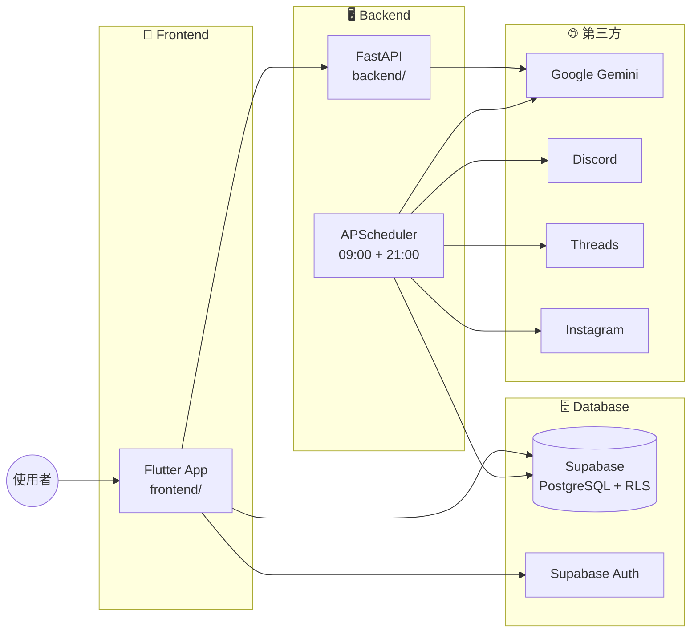
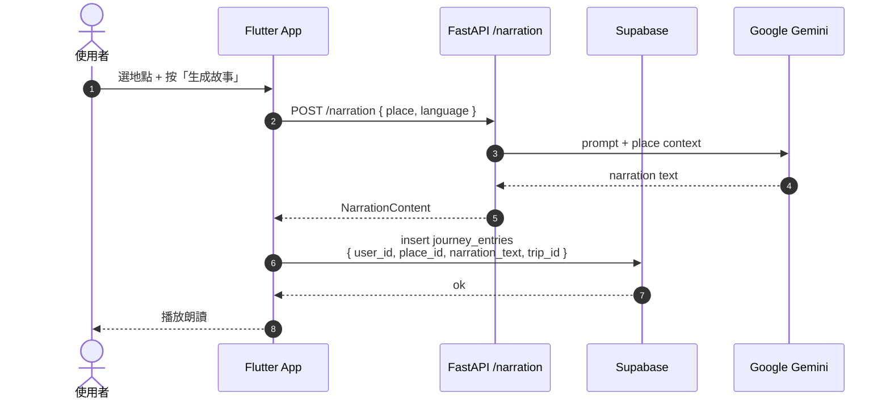

# Project Onboarding 工作流程

把一個 monorepo 專案的整體樣貌，重新組織成**系統架構圖 + 元件清單 + 資料表清單 + 核心 E2E 流程**，生成可點擊瀏覽的本機 web 頁面。使用者在瀏覽器自由翻閱，chat 中只負責回答後續問題。

## 工作流程概覽

```
┌──────────────────────────────────────────────────────────────┐
│  Phase 1: 靜默掃描（不對使用者輸出大量內容）                     │
│  ┌──────────┐  ┌──────────┐  ┌──────────┐                   │
│  │ Agent A  │  │ Agent B  │  │ Agent C  │  ← 三個平行 Explore │
│  │ 結構/CI/ │  │ DB schema│  │ Routes/  │                   │
│  │ 部署     │  │ /所有表  │  │ Endpoints│                   │
│  └──────────┘  └──────────┘  └──────────┘                   │
│                       ↓                                       │
│              推斷 E2E 流程清單                                 │
│              （補齊到 100% DB 覆蓋）                            │
└──────────────────────────────────────────────────────────────┘
                           ↓
┌──────────────────────────────────────────────────────────────┐
│  Phase 2: 生成 HTML + 啟動 server                              │
│  ① 寫 index.html（系統架構 + 元件 + 資料表 + E2E 清單）        │
│  ② 寫 flow-<slug>.html × N（每個 E2E 流程一頁）                │
│  ③ python3 -m http.server <random_free_port>（背景跑）         │
│  ④ open http://localhost:<port>                                │
│  ⑤ 一句話告訴使用者：「已掃描、瀏覽器開好了、URL=…」            │
└──────────────────────────────────────────────────────────────┘
                           ↓
┌──────────────────────────────────────────────────────────────┐
│  Phase 3: 等使用者                                              │
│  不主動講話。使用者看完 / 提問時，用 Phase 1 已收集的資訊回答。    │
└──────────────────────────────────────────────────────────────┘
```

---

## Phase 1 — 靜默掃描全專案

**對使用者只說一句話**：「正在掃描專案，請稍候…」。其他輸出全部留到 Phase 2 的 HTML。

### 1.1 同時派出 3 個 Explore agent（單一訊息中平行呼叫）

| Agent | 目標 |
|---|---|
| **A: 結構 / 技術棧 / CI / 部署** | 認出 monorepo 工具與所有子專案的技術棧、CI/CD pipeline、部署設定、第三方服務 |
| **B: 資料層** | 列出所有資料表 / 集合、推斷每張表用途、抓出關鍵欄位（PK、FK、status 類） |
| **C: 介面與 API** | 前端路由與主要頁面、後端所有 endpoint、主要 service 入口、scheduler / cron 觸發點 |

#### Subagent A 的 prompt

```
你負責掃描這個 monorepo 的整體結構、技術棧、CI/CD 與部署設定。

Repository: <absolute repo path>

請完成：
1. 偵測 monorepo 工具（workspaces / nx / turbo / lerna / pnpm-workspace / Cargo workspace / go.work / 平鋪式）
2. 列出每個一級子目錄的角色（一句話）
3. 列出每個子專案的技術棧（語言、框架、版本）
4. 掃 .github/workflows/、.gitlab-ci.yml、Jenkinsfile 等 CI/CD pipeline
5. 掃 Dockerfile / docker-compose / k8s / Terraform / fly.toml / vercel.json 等部署設定
6. 列出實際使用的第三方服務（auth / DB / LLM / pay / map / social / analytics）
7. docs/ 下重要文件
8. 後端 / scheduler / publisher 的位置與形式

回傳單一 JSON：
{
  "projectName": "<從 package.json / pubspec.yaml / readme 推斷>",
  "headline": "<一句話描述這個專案做什麼>",
  "monorepoTool": "<工具名或 'flat'>",
  "topLevelDirs": [{ "path": "frontend/", "role": "..." }, ...],
  "subProjects": [
    {
      "name": "frontend",
      "path": "frontend/",
      "stack": "Flutter / Dart 3.x",
      "framework": "Riverpod + go_router",
      "purpose": "<一句話>"
    },
    ...
  ],
  "cicd": [
    { "name": "ci.yml", "path": ".github/workflows/ci.yml", "trigger": "...", "purpose": "..." },
    ...
  ],
  "deployment": [
    { "target": "Backend VPS", "config": "backend/Dockerfile + docker-compose.yml", "purpose": "..." },
    ...
  ],
  "thirdParty": [
    { "category": "auth", "name": "Supabase", "purpose": "..." },
    { "category": "llm", "name": "Google Gemini", "purpose": "..." },
    ...
  ],
  "docs": [
    { "path": "docs/DESIGN_SYSTEM.md", "purpose": "..." },
    ...
  ],
  "scheduler": {
    "form": "<APScheduler 內建 / GitHub Actions cron / VPS crontab / Supabase cron / 無>",
    "where": "<檔案路徑:行號>",
    "jobs": [
      { "time": "09:00 Asia/Taipei", "name": "...", "purpose": "..." },
      ...
    ]
  }
}

只報事實，不要推測。直接回 JSON，不要 markdown code fence。
```

#### Subagent B 的 prompt

```
你負責掃描這個 monorepo 的所有資料表 / 集合 schema。

Repository: <absolute repo path>

請檢查：
1. supabase/migrations/、prisma/schema.prisma、migrations/、*.sql 等 schema 來源
2. ORM model / entity 檔案
3. ENUM type、RLS policy、trigger
4. 前端 DTO / mapper 對應的表

回傳單一 JSON：
{
  "tables": [
    {
      "id": "daily-stories",
      "name": "daily_stories",
      "purpose": "<一句話：這張表幹嘛用的>",
      "primaryKey": "id (UUID)",
      "foreignKeys": ["place_id → daily_story_places(id)"],
      "keyFields": ["publish_date", "language", "review_state ENUM"],
      "rls": "<一句話描述存取規則>",
      "writeTriggers": [
        "<什麼操作會寫入這張表，例如：後端 cron 09:00 生成故事時>"
      ]
    },
    ...
  ],
  "enums": [
    { "name": "review_state", "values": ["pending", "published", "rejected", "skipped", "failed"], "usedIn": ["daily_stories"] }
  ],
  "relationships": [
    { "from": "journey_entries.user_id", "to": "auth.users.id", "kind": "FK on delete cascade" },
    ...
  ]
}

僅列出真實存在的表，不要漏。同表多 migration 以最新 schema 為準。直接回 JSON。
```

#### Subagent C 的 prompt

```
你負責掃描這個 monorepo 的前端路由、後端 endpoint、以及使用者面對的主要流程。

Repository: <absolute repo path>

請完成：
1. 前端路由表（router 設定檔，列出 path → screen 檔案 + 行號）
2. 前端 features / pages / modules 清單（每個一句話用途）
3. 後端 endpoints / Edge Functions / RPC（method + path + 進入點檔案）
4. scheduler / cron 觸發點（檔案 + 排程時間）
5. 主要進入點（main、app、server、AppHost 等）
6. 使用者面對的主要頁面 / tabs（一句話「使用者在這做什麼」）

回傳單一 JSON：
{
  "routes": [
    { "path": "/", "name": "home", "screen": "frontend/.../main_screen.dart", "line": 1, "purpose": "..." },
    ...
  ],
  "features": [
    { "name": "narration", "path": "frontend/lib/features/narration/", "purpose": "...", "fileCount": 27 },
    ...
  ],
  "endpoints": [
    { "method": "POST", "path": "/narration/hooks", "handler": "backend/.../api.py:69", "purpose": "..." },
    ...
  ],
  "entryPoints": [
    { "label": "Flutter main", "file": "frontend/lib/main.dart", "line": 20, "purpose": "..." },
    ...
  ],
  "mainTabs": [
    { "name": "Stories", "screen": "...", "purpose": "..." },
    ...
  ]
}

每個檔案路徑請帶 :行號 方便跳轉。直接回 JSON，不要 markdown code fence。
```

### 1.2 推斷 E2E 流程清單

主 context 收到 3 個 JSON 後，自行推斷 E2E 流程，**保證 100% DB 覆蓋**：

1. 從 routes / endpoints / scheduler 推斷自然的使用者操作流程或排程流程
2. 對每張資料表，檢查它至少被一個 E2E 流程「寫入或讀取」
3. 若有表未被覆蓋，**自動補一個 E2E 流程**（例如：管理員操作、排程任務、Webhook 接收）
4. 對每個 E2E 流程，產出以下結構：

```json
{
  "id": "daily-story-pipeline",
  "name": "後端排程：09:00 生成日故事 → Discord 審查 → 21:00 發佈",
  "summary": "<2-3 句中文：這個流程的目的與最終結果>",
  "triggers": "<什麼觸發，例如「APScheduler 每日 09:00」或「使用者按 Stories tab」>",
  "coveredTables": ["daily_story_places", "daily_stories"],
  "participants": [
    { "id": "Sched", "label": "APScheduler", "layer": "backend" },
    { "id": "Gemini", "label": "Google Gemini", "layer": "external" },
    { "id": "Discord", "label": "Discord", "layer": "external" },
    { "id": "DB", "label": "Supabase", "layer": "db" }
  ],
  "steps": [
    {
      "index": 1,
      "actor": "Sched",
      "userAction": "<若為使用者觸發>",
      "frontendAction": "<前端做什麼>",
      "backendAction": "<後端做什麼>",
      "dbOperation": "<寫入/讀取哪張表，關鍵欄位>",
      "file": "backend/src/.../api.py",
      "line": 34,
      "note": "<重要設計決策或注意點>"
    },
    ...
  ],
  "relatedComponents": ["daily_story", "social"],
  "relatedTables": ["daily_story_places", "daily_stories"]
}
```

**規則**：
- 一個 E2E 流程的 `steps` 通常 4-10 步；過長代表拆得太粗，建議拆兩條
- 排程 / cron 類流程也算 E2E（actor 是排程器，不一定要有使用者）
- 第三方服務（LLM / Discord / Threads / Stripe...）用 `layer: "external"`
- 若兩條流程很像，合併成一條，用 step 註記分支

### 1.3 結果整合

主 context 把所有 JSON 合併成單一物件：

```json
{
  "scan": { ... Subagent A 結果 ... },
  "schema": { ... Subagent B 結果 ... },
  "interface": { ... Subagent C 結果 ... },
  "flows": [ ... 推斷出的 E2E 流程 ... ],
  "coverage": { "totalTables": N, "coveredTables": N }
}
```

**主 context 不複述任何 JSON 原文**——它只用來餵 HTML。

---

## Phase 2 — 生成 HTML + 啟動 server

### 2.1 準備輸出目錄

```bash
mkdir -p docs/project-overview/
```

每次清空舊內容（同 repo 再次執行直接覆蓋）。

### 2.2 生成 `index.html`

結構：

```
┌────────────────────────────────────────────────────────────┐
│ <Project Name>                          [stack badges]     │
│ <headline，一句話>                                          │
├────────────────────────────────────────────────────────────┤
│ 🗺️ 系統架構                                                │
│ ┌──────────────────────────────────────────────────────┐ │
│ │ [Mermaid graph LR / TB]                                │ │
│ │   subgraph FE [Frontend]                                │ │
│ │   subgraph BE [Backend]                                 │ │
│ │   subgraph DB [Database]                                │ │
│ │   subgraph TP [第三方]                                  │ │
│ │   ... 主要資料流箭頭                                    │ │
│ └──────────────────────────────────────────────────────┘ │
├────────────────────────────────────────────────────────────┤
│ 🧩 元件清單                                                  │
│ ┌─ Sub-projects ─────────────────────────────────────────┐ │
│ │  [Card] frontend/ — Flutter App                          │ │
│ │  [Card] backend/  — Python FastAPI                       │ │
│ │  ...                                                      │ │
│ ├─ CI/CD ────────────────────────────────────────────────┤ │
│ │  [Card] ci.yml — 每次 push / PR 跑 lint + test           │ │
│ │  ...                                                      │ │
│ ├─ 部署 ─────────────────────────────────────────────────┤ │
│ │  [Card] Backend VPS — Docker Compose, port 8001         │ │
│ │  ...                                                      │ │
│ ├─ 第三方 ───────────────────────────────────────────────┤ │
│ │  [Badge] Supabase / Gemini / Discord / Threads / ...     │ │
│ └────────────────────────────────────────────────────────┘ │
├────────────────────────────────────────────────────────────┤
│ 🗄️ 資料表清單  (N 張 · 覆蓋率 N/N)                          │
│ ┌────────────────────────────────────────────────────────┐ │
│ │ | 表名 | 用途 | 關鍵欄位 | 寫入時機 | 涵蓋於流程 |     │ │
│ │ | daily_stories | 每日故事 | review_state | cron | 流程 2 │
│ │ | journey_entries | 旅程條目 | trip_id, user_id | 使用者建立故事 | 流程 5 │
│ │ ...                                                      │ │
│ └────────────────────────────────────────────────────────┘ │
├────────────────────────────────────────────────────────────┤
│ 🔄 核心 E2E 流程  (N 條，覆蓋 100% 資料表)                  │
│ ┌────────────────────────────────────────────────────────┐ │
│ │ [Card] 1. 使用者註冊 / 登入 / Onboarding                 │ │
│ │   摘要 · 覆蓋: auth.users                                │ │
│ │   → 點開看 sequence + 逐步詳解                            │ │
│ │ [Card] 2. 後端排程: 日故事生成 → 審查 → 發佈              │ │
│ │   摘要 · 覆蓋: daily_story_places, daily_stories         │ │
│ │ ...                                                       │ │
│ └────────────────────────────────────────────────────────┘ │
└────────────────────────────────────────────────────────────┘
```

### 2.3 生成 `flow-<slug>.html` × N

每個 E2E 流程一頁，結構：

```
┌────────────────────────────────────────────────────────────┐
│ ← Index    流程 N / M                                     │
├────────────────────────────────────────────────────────────┤
│ <Flow Name>                            [coverage badges]   │
│ 觸發：<triggers>                                            │
│ 摘要：<summary>                                              │
├────────────────────────────────────────────────────────────┤
│ 📊 Sequence                                                  │
│ ┌──────────────────────────────────────────────────────┐ │
│ │ [Mermaid sequenceDiagram]                              │ │
│ │   actor User                                            │ │
│ │   participant FE as Flutter App                         │ │
│ │   participant API as FastAPI                            │ │
│ │   participant DB as Supabase                            │ │
│ │   participant Gemini as Google Gemini                   │ │
│ │   User->>FE: ...                                        │ │
│ │   FE->>API: ...                                         │ │
│ │   ...                                                    │ │
│ └──────────────────────────────────────────────────────┘ │
├────────────────────────────────────────────────────────────┤
│ 🔢 逐步詳解                                                  │
│ ┌─ Step 1 ───────────────────────────────────────────────┐ │
│ │  Actor: APScheduler   File: backend/.../api.py:34       │ │
│ │  動作：每日 09:00 觸發 daily_story_generate              │ │
│ │  說明：時區 Asia/Taipei；無使用者操作                     │ │
│ │  DB：無                                                  │ │
│ ├─ Step 2 ───────────────────────────────────────────────┤ │
│ │  ...                                                     │ │
│ └────────────────────────────────────────────────────────┘ │
├────────────────────────────────────────────────────────────┤
│ 💾 涉及資料表                                                │
│ • daily_story_places (read) — 選下一個未使用的地點           │
│ • daily_stories (insert) — 寫入 review_state='pending'      │
├────────────────────────────────────────────────────────────┤
│ 🧩 相關元件                                                  │
│ • daily_story/ (backend) · social/ (backend)                │
├────────────────────────────────────────────────────────────┤
│ Navigation                                                  │
│ [← 流程 N-1]   [Index]   [流程 N+1 →]                       │
└────────────────────────────────────────────────────────────┘
```

### 2.4 HTML 技術細節

- 純 static HTML，無 build step
- CDN：`mermaid`（架構與 sequence 圖）、`highlight.js`（程式碼 syntax）
- 自帶 inline `<style>` block；單一暗色系
- 字型：`system-ui, -apple-system, "PingFang TC"`
- 內容寬度 `max-width: min(1600px, 95vw)`（sequence 圖很需要橫向空間）
- 互動：
  - 元件 card → 不一定要連結（沒目標頁），用 hover 顯示更詳細描述
  - 資料表 row → 點擊跳到涵蓋它的第一個 flow 頁面
  - E2E 流程 card → 跳 `flow-<slug>.html`
  - flow 頁面的「相關資料表」、「相關元件」→ 跳回 index 的對應區段（用 anchor `#tables`, `#components`）

#### Mermaid 渲染規則（解決「圖太小」問題）

**Mermaid 預設行為的坑**：`useMaxWidth: true` 只給 SVG `max-width: 100%`，遇到 container 比 SVG 自然寬度大時，SVG 不會放大，導致圖縮在角落。要靠 CSS 強制把 SVG 撐到 container 寬度，並把字級調大。

**必填的 mermaid init**：

```html
<script type="module">
  import mermaid from 'https://cdn.jsdelivr.net/npm/mermaid@10/dist/mermaid.esm.min.mjs';
  mermaid.initialize({
    startOnLoad: true,
    theme: 'dark',
    securityLevel: 'loose',
    flowchart: {
      useMaxWidth: true,
      htmlLabels: true,
      curve: 'basis',
      nodeSpacing: 60,
      rankSpacing: 80
    },
    sequence: {
      useMaxWidth: true,
      actorFontSize: 16,
      noteFontSize: 14,
      messageFontSize: 14,
      boxMargin: 16,
      width: 180,
      mirrorActors: false,
      wrap: true
    },
    themeVariables: { fontSize: '16px' }
  });
</script>
```

**必填的 CSS**：

```css
.mermaid {
  width: 100%;
  margin: 24px 0;
  text-align: center;
  overflow-x: auto;
}
.mermaid svg {
  width: 100% !important;
  height: auto !important;
  max-width: none !important;
  min-height: 320px;
}
.flow-sequence .mermaid svg {
  min-height: 480px;
}
```

### 2.5 系統架構 Mermaid 範本



### 2.6 Sequence 範本



**約定**：
- `actor` 永遠在最左
- DB 寫入動詞用 `insert / update / delete / read` 開頭，後面跟資料 shape
- 第三方用 `participant <Short> as <服務名>`
- 排程 / cron 觸發的 sequence：`actor Sched as APScheduler` 取代 `actor User`

### 2.7 啟動 server

```bash
PORT=$(python3 -c "import socket; s=socket.socket(); s.bind(('', 0)); print(s.getsockname()[1]); s.close()")
cd docs/project-overview/
nohup python3 -m http.server $PORT > /tmp/project-onboarding.log 2>&1 &
SERVER_PID=$!
open "http://localhost:$PORT/"
```

或用 `Bash` 工具的 `run_in_background: true`。

### 2.8 對使用者報告（單一訊息）

```
已掃描專案完成。

🎯 <headline>

📂 docs/project-overview/
🌐 http://localhost:<port>/  ← 瀏覽器已開啟
🛑 關 server: `kill <pid>` 或 `pkill -f "http.server <port>"`

打開後可以：
1. 看系統架構圖（前端 / 後端 / DB / 第三方怎麼連）
2. 看元件清單（每個子專案、CI/CD、部署、第三方服務）
3. 看資料表清單（N 張，覆蓋率 100%）
4. 點任一條 E2E 流程，看 sequence + 逐步詳解（檔案路徑與行號可直接跳轉）

有問題隨時問。
```

---

## Phase 3 — 等使用者

不主動講話。使用者在瀏覽器自由翻閱，回頭問問題時直接回答。常見問題：

- 「資料表 X 為什麼這樣設計？」→ 用 Phase 1 已分析過的 schema + writeTriggers 解釋
- 「流程 Y 的 Step N 在哪個檔案？」→ JSON 已有 `file:line`，直接給
- 「能不能解釋這段程式碼？」→ 讀對應檔案、解釋
- 「我想看 CI/CD 細節」→ 從 scan.cicd 補充
- 「要新增功能該動哪個 feature 資料夾？」→ 從 interface.features 配合 schema 判斷

---

## 行為原則

1. **繁體中文**——所有 UI 標籤、card 標題、step 描述全部繁中
2. **Phase 1 靜默**——除了「正在掃描專案…」一句外，不刷掃描中間結果
3. **主 context 不留 raw schema / route list**——這些字串只進 HTML 檔
4. **subagent 平行派出**——單一訊息派三個 Agent（A 結構、B schema、C 介面）
5. **100% DB 覆蓋率**——每張資料表必須至少被一個 E2E 流程涵蓋。若推斷不出，自動補一個「管理員操作」或「排程任務」流程
6. **檔案路徑帶行號**——`path/to/file.ts:42` 方便使用者跳轉
7. **Mermaid 圖必須撐滿容器寬度 + 字級夠大**——套用 §2.4「Mermaid 渲染規則」的 init config + CSS 強制 `svg { width: 100% !important }`、字級 ≥ 14px。內容寬度 `max-width: min(1600px, 95vw)`，不要用窄欄
8. **不修改使用者程式碼**——只讀檔、寫 `docs/project-overview/`、啟動 server
9. **覆蓋舊輸出**——同 repo 再次執行直接覆蓋
10. **Server 生命週期使用者自管**——告訴 PID 與如何關，不主動關
11. **輸出進 `docs/project-overview/`，會被版控**——所有 HTML 寫到該目錄。`docs/` 通常會被 commit 進 repo，導覽 HTML 會跟著被追蹤；這是刻意設計，讓專案可離線翻閱、PR 中也能審查導覽變更。若使用者不希望追蹤，由他們自行加 `.gitignore`，本 skill 不主動修改

---

## 邊界情境

| 情境 | 處理方式 |
|---|---|
| 沒有 DB 的專案（純前端 lib、CLI、SDK） | 資料表區塊改顯示「無資料表」；E2E 改以「使用者操作 → 狀態變化 / 副作用」為主軸 |
| 沒有 backend 的專案（純 SPA） | E2E 改以「UI → 第三方 API / localStorage」為主軸 |
| 找不到 routes / endpoints | Subagent C 回 `routes: []`；HTML 提示「未偵測到明顯入口，請使用者補充」 |
| 巨型 monorepo（>50 子專案） | Phase 2 index 把子專案分組顯示；E2E 流程仍以 DB 覆蓋為主軸 |
| 看不懂某張表用途 | `purpose` 標「用途不明」；HTML 用淡色標註，邀請使用者補充 |
| 資料表完全找不到 schema 來源 | Subagent B 回 `tables: []`；index 顯示「無法偵測 DB schema」並列出可能來源讓使用者指認 |
| 同一張表被多個 migration 改過 | 以最新 schema 為準（Subagent B 自行處理） |
| Port 全被佔 | fallback 到 `0` 讓 OS 給 |
| 使用者中途說「結束導覽」 | `kill <PID>` server，保留 HTML 供下次直接 open |
| `python3` 不在 PATH | 試 `python`，再不行就 fallback 到 `npx http-server` |
| 使用者中途要 Claude 改程式碼 / 寫測試 | 這個 skill 只負責導覽，禮貌提示「導覽完之後再開新對話做改動」或先 kill server 結束 |
| 同 repo 跑第二次 | 覆寫舊 HTML、port 重抓、PID 不同 |

---

## 範例輸出（Phase 2 結尾使用者看到的）

```
已掃描專案完成。

🎯 Lorescape：AI 旅遊故事 App，Flutter 前端 + Python 日故事
   pipeline，自動發佈到 Threads / Instagram。

📂 docs/project-overview/
🌐 http://localhost:7423/  ← 瀏覽器已開啟
🛑 關 server: `kill 12345`

打開後可以：
1. 看系統架構圖（前端 / 後端 / DB / 第三方怎麼連）
2. 看元件清單（5 個子專案、5 個 CI workflow、8 個第三方服務）
3. 看資料表清單（6 張，覆蓋率 100%）
4. 點任一條 E2E 流程，看 sequence + 逐步詳解

有問題隨時問。
```
